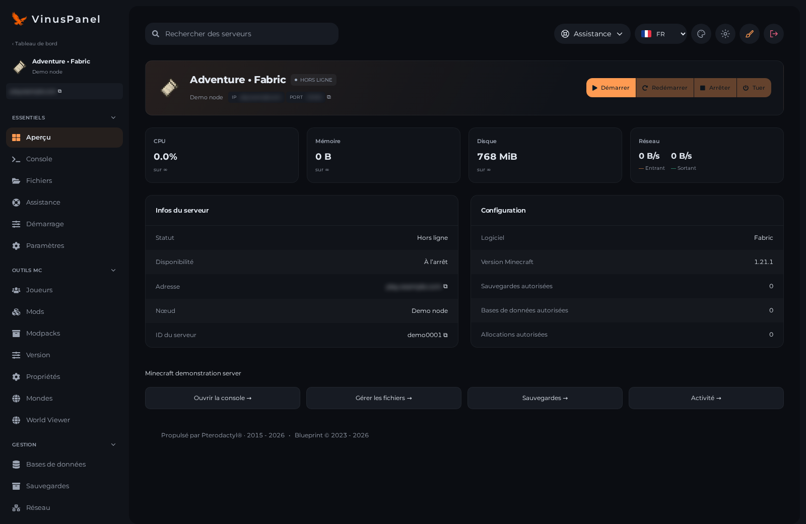
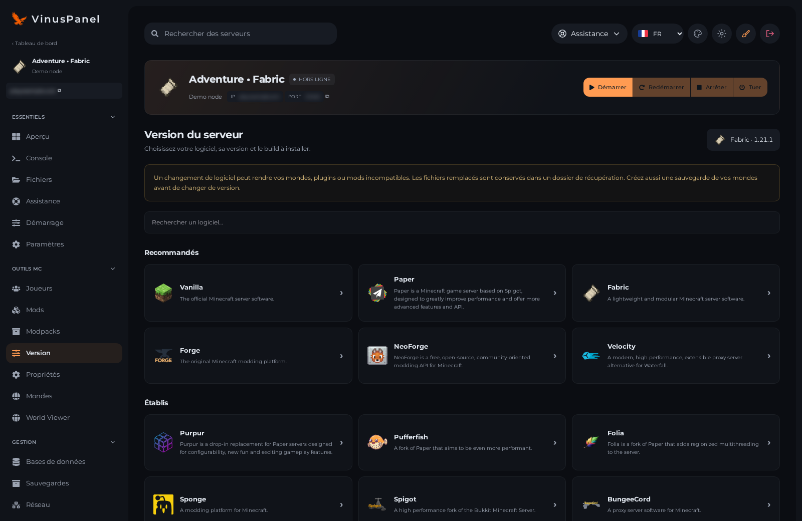

<div align="center">


# VinusPanel 3.2.0

**Thème Pterodactyl gratuit et open source, avec dashboard adaptatif, Design Studio et espace de gestion Minecraft.**

[English](README.md) · **Français** · [Installation détaillée](INSTALLATION.fr.md) · [Changelog](CHANGELOG.md)

</div>

[Documentation complète sur GitBook](https://vinuspanel.gitbook.io/vinuspanel-docs/) — installation, Design Studio, outils Minecraft, joueurs, administration et dépannage. La documentation distingue les fonctions de la branche de développement des anciennes versions publiées. [Sources Markdown](docs/gitbook/README.md).

## Interface

Le dashboard utilise la largeur disponible, y compris en 1920 et 3440 px. Les logos identifient le logiciel déclaré des serveurs. La navigation regroupe l’aperçu, la console, les fichiers et les outils disponibles selon les permissions et le logiciel.

La branche de développement comprend également une nouvelle vue d’ensemble du compte et une administration redessinée : navigation recherchable, tableaux adaptatifs et formulaires harmonisés. Les formulaires, permissions et actions Pterodactyl sont conservés. La photo de compte est stockée dans le navigateur et ne se synchronise pas entre appareils. La navigation et l’accueil administrateur sont en français/anglais ; les textes des formulaires historiques gardent leur langue d’origine.

Les captures utilisent l’interface réelle avec des **données de démonstration**. Aucun compte, serveur ou réglage privé n’y figure. Les mises en page promotionnelles sont réalisées avec Higgsfield.






## Fonctionnalités

| Zone | Contenu |
| --- | --- |
| Design Studio | Nom, logo, fond, couleurs, bannières par serveur et aperçu avant enregistrement. |
| Dashboard | Recherche, liste/grille, état et ressources en direct, palette personnelle, français/anglais. |
| Console | Terminal Wings, recherche, filtres, taille du texte, export local des logs et commandes selon les permissions. |
| Gestion | Fichiers compacts, bases, sauvegardes, allocations, tâches, utilisateurs et activité. |
| Catalogue optionnel | Modrinth, plugins SpigotMC gratuits compatibles et adaptateur CurseForge avec clé privée. |
| Outils Minecraft | Choix du logiciel/build/Java, modpacks, propriétés/MOTD, import de mondes et visionneuse BlueMap authentifiée. |

Les modules absents sont masqués. Le thème ne fournit pas de facturation, de gestion des sous-domaines ou d’outils pour d’autres jeux. Les traductions couvrent les écrans VinusPanel ; les logs, contenus des fournisseurs et pages d’administration historiques conservent leur langue.

## Compatibilité et installation

Validé avec **Pterodactyl 1.15.1**, **Node 22**, **Yarn 1.x**, **PHP 8.3** et Ubuntu 24.04. Blueprint est optionnel pour le thème ; **beta-2026-06** est requis pour **Vinus Catalog 1.4.0**. D’autres versions ou thèmes ne sont pas automatiquement compatibles.

Sur un **VPS Ubuntu 24.04 vierge**, `install.sh` installe tout : Pterodactyl Panel 1.15.1, MariaDB, Redis, Nginx, le worker, le thème, Docker et Wings. Sur un panel Pterodactyl déjà installé, il applique seulement le thème. Sauvegarder le panel, sa base, ses configurations et les serveurs avant toute installation sur une machine existante.

```bash
apt update && apt install -y git curl
git clone --branch main --single-branch https://github.com/yhanottv/VinusPanel.git
cd VinusPanel
sudo bash install.sh --check      # rapport, aucune modification
sudo bash install.sh --install    # ou sans option : menu interactif, choix [1]
```

Les identifiants générés sont enregistrés dans `/var/lib/vinuspanel/credentials.txt`. Pour un autre chemin de panel, ajouter `--panel-dir /chemin/du/panel`. Le script sauvegarde les fichiers concernés, place temporairement le panel en maintenance et compile les ressources. Il ne démarre ni n’arrête les serveurs de jeu. Les réglages Design Studio restent sur l’installation. Avant d’ouvrir le panel au public : HTTPS, pare-feu et sauvegardes, voir la [documentation](https://vinuspanel.gitbook.io/vinuspanel-docs/).

Le thème **n’installe pas automatiquement** les outils Minecraft. Sur un VPS vierge : installer le panel et le thème, puis Blueprint `beta-2026-06`, réappliquer le thème (`sudo bash install.sh --update`), puis construire et installer l’extension :

```bash
cd extensions/vinuscatalog
zip -r vinuscatalog.blueprint conf.yml admin app components routes config tests README.md
sudo cp vinuscatalog.blueprint /var/www/pterodactyl/
cd /var/www/pterodactyl
sudo blueprint -install vinuscatalog
```

Consulter le [guide VPS détaillé](INSTALLATION.fr.md), la [configuration de l’extension](extensions/vinuscatalog/README.md) et les [notes de mise à jour](docs/server-workspace/UPGRADE.md).

## Configuration privée et limites

Les clés API, correspondances d’eggs/serveurs, données de mondes et réglages locaux restent dans le panel. Le dépôt contient uniquement un exemple de configuration vide. Ne jamais publier `.env`, les sauvegardes, les identifiants ou les captures contenant des informations privées.

CurseForge nécessite votre propre clé API ; son intégration réelle reste à valider pour cette version. Les restrictions de distribution des auteurs s’appliquent. Les projets payants, privés ou téléchargés depuis des sources externes non prises en charge ne sont pas installables automatiquement.

Les installations nécessitent un serveur arrêté et les permissions appropriées. Les changements conservent un dossier de récupération ; une restauration incomplète peut maintenir le serveur suspendu jusqu’à intervention. Les mods tiers ne sont pas garantis sans conflit. BlueMap exige un premier rendu et le choix explicite de l’administrateur pour le téléchargement des ressources.

## Mise à jour et désinstallation

Après sauvegarde et lecture du changelog : `git pull --ff-only`, puis `sudo bash install.sh`. Mettre aussi l’extension à jour séparément. Préserver les modifications locales dans une branche ou un fork.

`sudo bash uninstall.sh` restaure les fichiers originaux suivis et reconstruit les ressources. Il ne désinstalle pas Blueprint ou Vinus Catalog. Les sauvegardes d’installation se trouvent dans `/var/backups/vinuspanel/` et les originaux suivis dans `/var/lib/vinuspanel/original` ; elles ne remplacent pas une sauvegarde complète.

## Vérifications

TypeScript standard/Blueprint, compilation de production et **117 contrôles frontend dans 15 suites**, complétés par des tests PHP des fournisseurs, archives, permissions et restaurations. Tests réels sur serveur jetable : Paper, Forge, modpack Fabric, plugin Spigot, monde ZIP et rendu BlueMap. Les 28 choix logiciels n’ont pas tous été démarrés.

Le dashboard a été vérifié à 3440, 1920 et 390 px sans débordement horizontal. Les appareils physiques, tous les navigateurs et une installation sur un panel entièrement neuf restent à valider. [Portée détaillée](docs/server-workspace/IMPLEMENTATION.md).

## Aide et licence

[GitHub Issues](https://github.com/yhanottv/VinusPanel/issues) · [Discord](https://discord.gg/vinuspanel). Joindre les versions et les étapes de reproduction, avec des captures anonymisées.

Code sous [licence MIT](LICENSE). Les notices Pterodactyl/Blueprint et les marques tierces sont recensées dans [licenses](licenses/). VinusPanel n’est pas une distribution officielle de ces projets.
