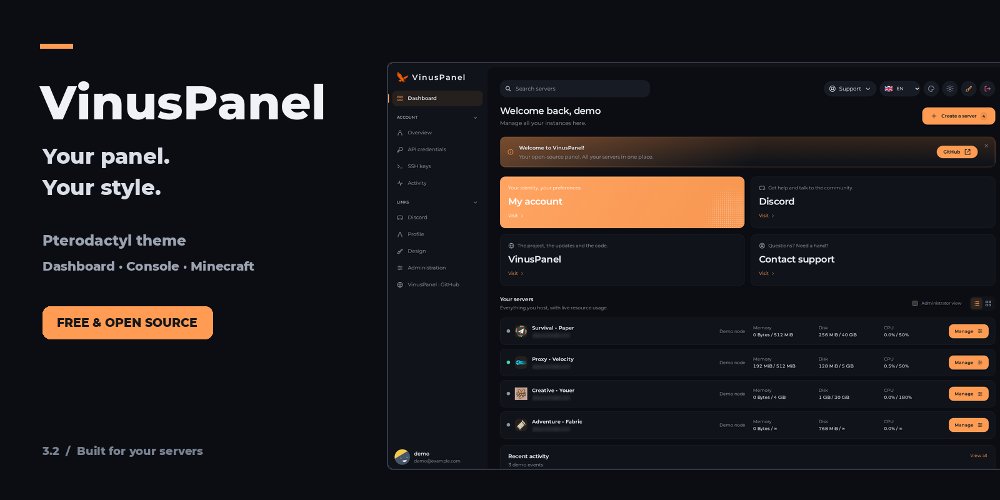
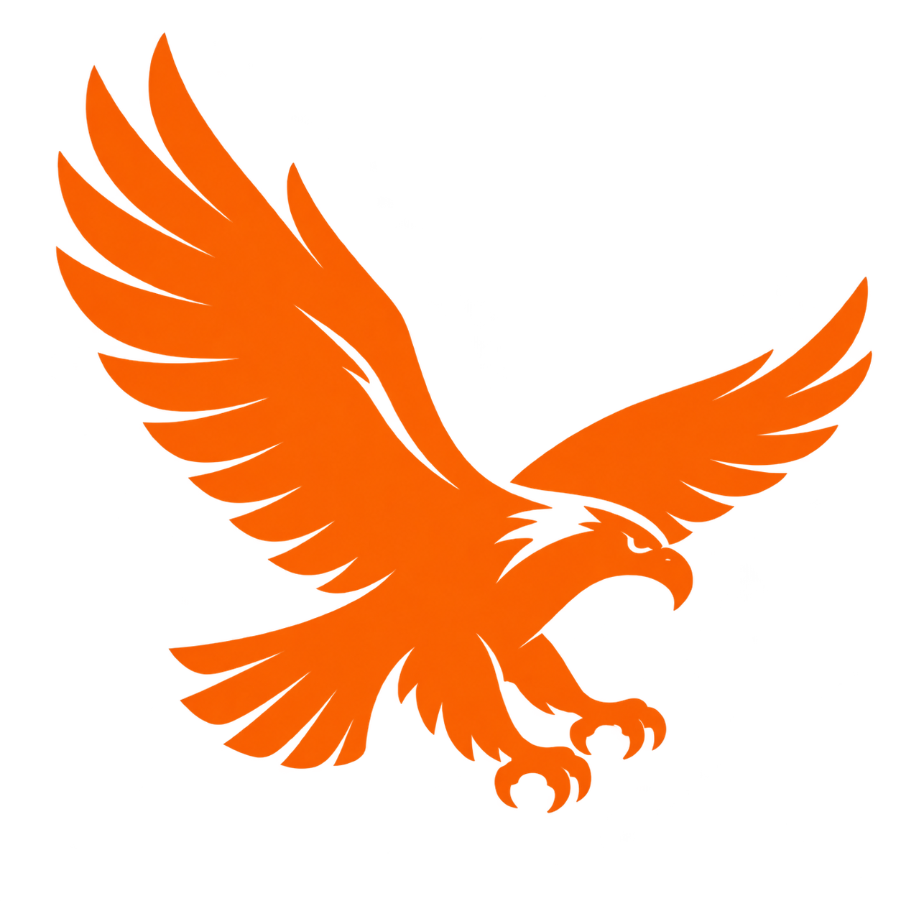
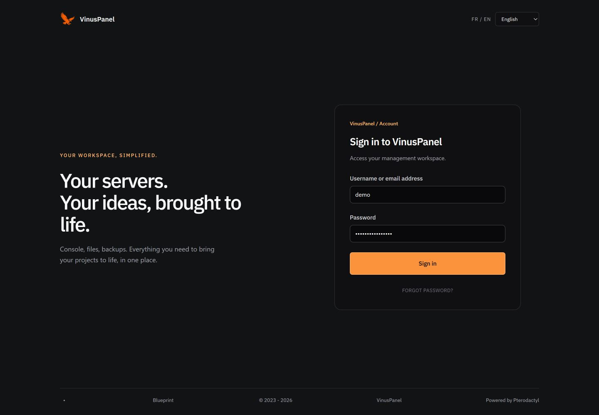
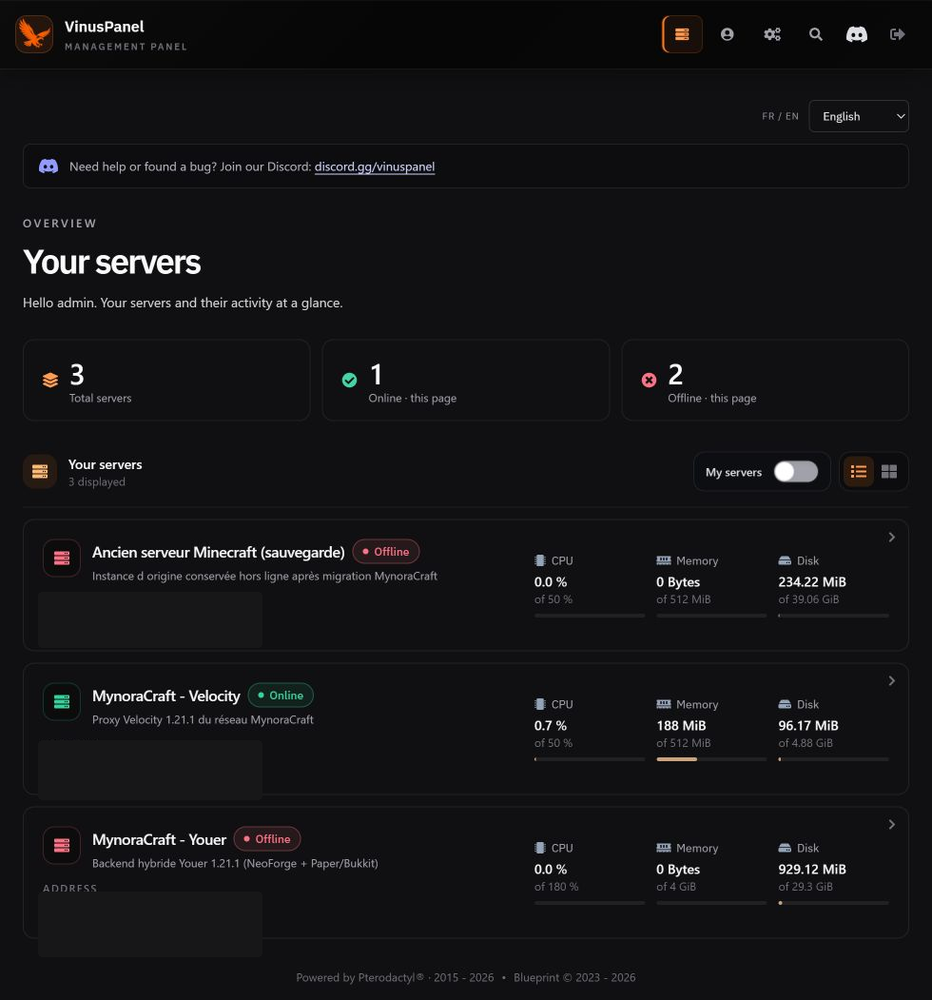
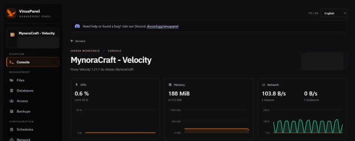
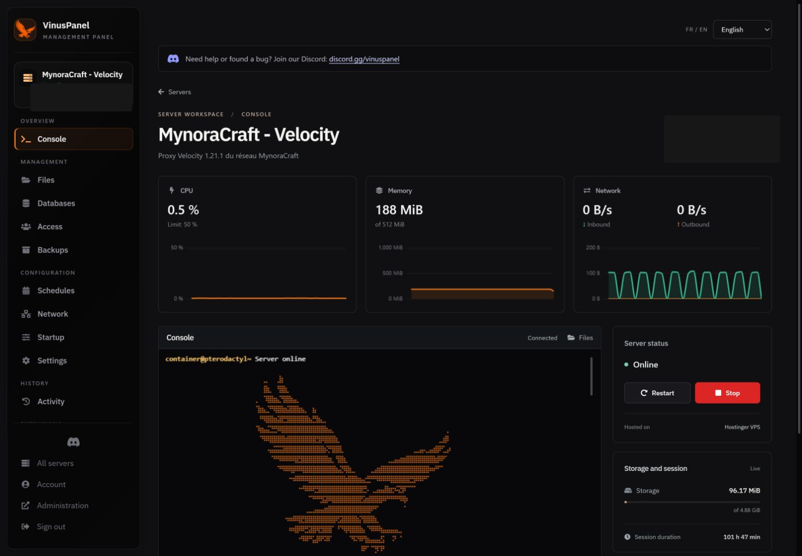
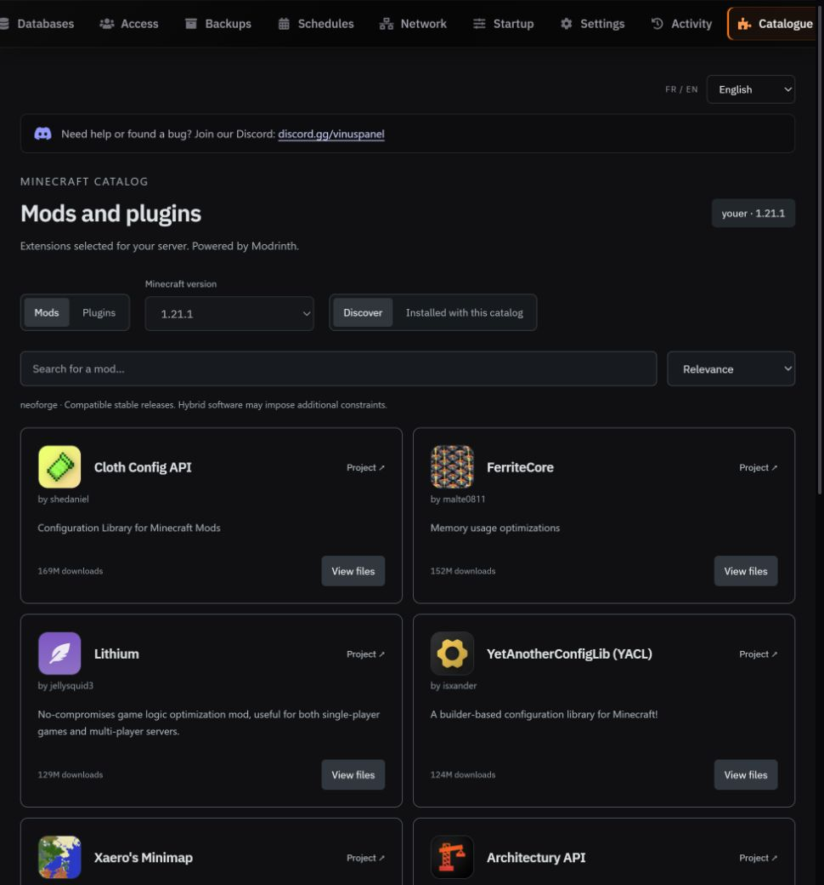
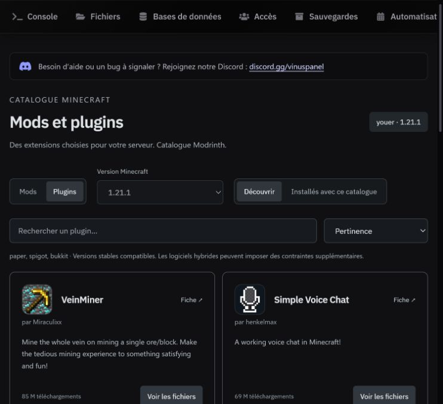

<div align="center">



<br />



# VinusPanel — Pterodactyl Theme

**A free, open-source Pterodactyl theme with an administrator Design Studio, per-server banners, Liquid Glass navigation, a redesigned console and an optional Minecraft catalog.**

[](https://github.com/yhanottv/VinusPanel/actions/workflows/validate.yml)
[](CHANGELOG.md)
[](#compatibility)
[](LICENSE)
[](https://discord.gg/vinuspanel)

**English** · [Français](README.fr.md)

[Screenshots](#screenshots) · [Features](#features) · [Installation](#installation) · [Compatibility](#compatibility) · [Minecraft catalog](#minecraft-catalog) · [Support](#support)

**New in 3.0:** open **Administration → Design** to change colors, the panel name, logo and background, plus colors and banners for individual servers. Settings and uploaded images persist across theme upgrades. See the [complete French VPS installation and Design guide](INSTALLATION.fr.md).

</div>

VinusPanel gives self-hosted game server panels a consistent black-and-orange interface, from the server dashboard to the console, files and account pages. Liquid Glass is limited to navigation, leaving logs and resource data on stable, readable backgrounds.

This repository contains a **theme overlay and installation tools**, not a complete Pterodactyl distribution. You need an existing Pterodactyl panel. The theme can manage servers for other games; only the optional catalog is Minecraft-specific.

> **French / English:** use the language selector on the sign-in screen or at the top of client pages. VinusPanel labels and catalog controls are available in both languages. Switching reloads the current page; save any edits first. Your preference is stored in this browser, with a `?lang=fr` / `?lang=en` fallback when storage is unavailable. Server content, game logs, provider errors, original upstream screens and third-party extensions keep their own language; this is not a translation of the legacy administration area.

<a id="screenshots"></a>

## 📸 Screenshots

Real screenshots of VinusPanel 2.4.0, with English selected. IP addresses are masked. The login form contains unsubmitted demonstration values. Server states and charts use real data; no game server was restarted for these previews. Player logs and personal account details are excluded.

**Sign in — choose French or English before accessing the panel.**



**Your servers — online and offline states at a glance.**



**Live resources — CPU, memory and incoming/outgoing network activity.**



**Console — the orange eagle inside the terminal, alongside live resources and power controls.**



<details>
<summary>Explore the optional Minecraft catalog</summary>

**Mods — search and project icons for the detected loader.**



**Plugins — a separate category on supported hybrid servers.**



The catalog requires the optional Blueprint extension. See [catalog compatibility](#minecraft-catalog) before installing.

</details>

<a id="features"></a>

## ✨ Features

| Area | What you get |
| --- | --- |
| Design Studio | Admin controls for the panel name, colors, logo and background, plus individual server colors and banners. |
| Black interface | Dark content surfaces and compact buttons, with colors that administrators can change. |
| Liquid Glass navigation | Translucent black navigation with subtle reflections, blur and an opaque fallback. |
| Server dashboard | Live status, search, and persistent grid/list view preferences. |
| Redesigned console | Live logs, command input, connection diagnostics and state-aware power controls. |
| Resource charts | CPU, memory and network always visible above the console, with progressive updates and separate incoming/outgoing rates. |
| Terminal signature | A detailed orange Unicode eagle, centered inside the terminal and retained in normal scrollback. |
| Minecraft catalog | Optional Blueprint extension with Modrinth search, project icons, compatible categories, dependency previews and tracked updates. |
| Account and management | Refreshed file manager, databases, backups, schedules, network, settings, profile and activity pages. |
| Community links | Discord logo button and help announcement sharing a configurable invitation. |

### 🖥️ A console built around server management

Power controls respect the server state, connection and user permissions. Forced stopping keeps its confirmation. Connection failures receive clearer guidance, and commands are unavailable while the connection or server state does not allow them.

Chart datasets are retained during telemetry updates rather than recreated every second. Network rates use actual elapsed time between samples. CPU, memory and network appear directly at the top without an accordion; storage and session duration have their own section.

The eagle appears after the initial known server status when opening the console and on transitions to startup. It has **no timed expiry**: subsequent logs can naturally scroll it out of view. The artwork uses Unicode characters for detail, adapts to terminal proportions, and is never sent as a server command or written into server log files. Command history stays in memory while the console is open.

Profile names and avatars are local to the browser. They do not change Pterodactyl login details or permissions and do not sync between devices. The legacy administration area receives a separate visual stylesheet.

<a id="compatibility"></a>

## 🧩 Compatibility

| Component | Requirement / tested scope |
| --- | --- |
| VinusPanel | Source version **3.0.0**. |
| Pterodactyl Panel | **1.15.1**. Other versions and forks are not validated. |
| Blueprint | Optional for the theme; **beta-2026-06** is the validated integration. Required for Vinus Catalog. |
| Vinus Catalog | Extension **1.2.0**, included in this repository. |
| Node.js | Installer requires **22+**; builds were validated on Node 22. Later major versions are not automatically certified. |
| Yarn | **1.x**. |
| PHP | Validated on **8.3**. Keep the PHP requirements of your panel and Blueprint installation. |
| Host OS | Deployed on **Ubuntu 24.04**. Bash scripts expect an Ubuntu/Debian-style Linux environment and the `www-data` web user. |
| Wings | An existing working Wings connection; the theme does not install or modify Wings. |

Install Blueprint **before** VinusPanel when you need its integration. The installer rejects an incompatible panel version when detectable and a detected Blueprint version other than the one supported. This is not a guarantee of compatibility with every third-party extension or another theme.

### 📱 Devices and browsers

The theme runs in a browser, with no native app required. Layout depends on the available viewport width.

| Device / viewport | Layout | Validation performed |
| --- | --- | --- |
| Desktop and laptop | Sidebar from 1,024 px; wider console and multi-column workspace. | Checked in an embedded Chromium browser, including a 1,440 px viewport. |
| Tablet / medium window | Horizontal navigation below 1,024 px, with rearranged content. | Checked at 742 px; not certified on every physical tablet. |
| Phone | Stacked cards on small screens, resized terminal and horizontally scrollable navigation. | Responsive preview checked at 390 px; physical iOS/Android device testing remains pending. |

Recent Chrome, Edge, Firefox and Safari on Windows, macOS, Linux, Android and iOS are **intended browser targets**, not a completed cross-browser certification matrix. Older browsers, Internet Explorer and unusual embedded WebViews are not validated. Blur depends on browser/graphics support; the navigation retains a dark background without it. JavaScript and WebSocket access to Wings are required for the live console.

Keyboard focus indicators, a skip-to-content link, keyboard-operable search, accessible icon labels and reduced-motion/transparency preferences are supported. This is not a claim of WCAG certification or a complete screen-reader audit.

<a id="installation"></a>

## 🚀 Installation

Use the machine hosting **Pterodactyl Panel**, not just a separate Wings node. You need SSH access, `sudo`, the panel's frontend sources and its dependencies.

Back up your panel, database and configuration first. The installer temporarily places the panel in maintenance mode while compiling assets. It does not issue start/stop commands to game servers.

```bash
git clone --depth 1 https://github.com/yhanottv/VinusPanel.git
cd VinusPanel

# Check requirements without changing the panel
bash install.sh --check

# Install the theme
sudo bash install.sh
```

The default panel directory is `/var/www/pterodactyl`. For a custom location:

```bash
bash install.sh --panel-dir /path/to/pterodactyl --check
sudo bash install.sh --panel-dir /path/to/pterodactyl
```

### What the installer does

1. Checks the package, required commands and detectable versions.
2. Backs up affected files and enters panel maintenance mode.
3. Installs the **75-file base overlay**, plus Blueprint variants/additional files when applicable.
4. Installs frontend dependencies if missing and adds the bundled font/test environment dependencies.
5. Builds production assets, clears Laravel caches and restores expected file ownership.
6. Records the installed version and exits maintenance mode.

On failure, the script attempts to restore backed-up files, rebuild and leave maintenance mode. These file backups do not cover the entire machine or every dependency change; keep a complete backup as well. Installing the theme does **not** automatically install Vinus Catalog.

<a id="minecraft-catalog"></a>

## 📦 Optional Minecraft mod and plugin catalog

**Blueprint is the extension framework. Modrinth is the content source.** Vinus Catalog can work independently of the theme; VinusPanel adds its navigation entry when installed.

| Detected server software | Available categories |
| --- | --- |
| Forge, NeoForge, Fabric, Quilt | **Mods** filtered for the corresponding loader. |
| Paper, Purpur, Spigot, Bukkit, Folia, Sponge | **Plugins only**, filtered for the detected profile. |
| Velocity, Bungeecord, Waterfall | **Plugins** for the proxy. |
| Youer, Mohist | Separate **Mods** and **Plugins** tabs. |
| Arclight | Both tabs once its Forge, Fabric or NeoForge loader is identified. |
| Vanilla or unknown software | No automatic downloads. |

Search includes project icons with an initial-letter fallback. Installation previews select a stable release declared compatible with the server and include required dependencies. Installing requires a **stopped server** and the appropriate Pterodactyl file permissions; the catalog does not stop the server for you.

The catalog tracks its own installed files and lets users check/apply compatible updates. Updates require user action. Existing JARs installed outside the catalog are not automatically imported into its tracking.

### Install the extension

After installing the compatible Blueprint version and the theme, run from the repository root (`zip` must be installed):

```bash
cd extensions/vinuscatalog
zip -r vinuscatalog.blueprint conf.yml admin app components routes config tests README.md
sudo cp vinuscatalog.blueprint /var/www/pterodactyl/
cd /var/www/pterodactyl
sudo blueprint -install vinuscatalog
```

Adapt the panel path if necessary. See the [detailed catalog guide, currently in French](extensions/vinuscatalog/README.md), for configuration and recovery details.

### Portable detection and limitations

Detection uses declared software, the selected JAR name and the egg name, with no hard-coded host-specific numeric egg IDs. Minecraft versions come from egg variables; users must select the installed version when it is missing or set to `latest`. Custom eggs may need local egg/server UUID mappings using the [empty configuration example](extensions/vinuscatalog/config/vinuscatalog.php.example). The panel must reach both Modrinth and Wings.

- **Modrinth only:** private, paid or platform-exclusive projects elsewhere are not included. This is not a universal catalog of every Minecraft mod and plugin.
- Automatic installation accepts one primary JAR up to **25 MiB**, up to **20 projects / 100 MiB per batch**, and **12 dependency levels**.
- Optional dependencies and conflicts with manually installed JARs are not resolved automatically.
- Author-declared compatibility does not guarantee conflict-free operation, especially on hybrid servers.
- Previous managed versions are retained in `/vinus-*` directories. Unknown or manually modified files are not overwritten.

## 🎨 Customization

Use **Administration → Design** for the panel name, colors, logo, background and per-server colors and banners. These settings apply on page refresh without rebuilding. The [French VPS guide](INSTALLATION.fr.md) covers the menu and installation. For advanced source changes, edit [`overlay/resources/scripts/theme.ts`](overlay/resources/scripts/theme.ts) and other components in the overlay.

| Setting | Purpose |
| --- | --- |
| `VINUS.name` | Name supplied by Design Studio to client components. |
| `VINUS.logo` | Logo supplied by Design Studio; does not regenerate the Unicode terminal artwork. |
| `VINUS.colors` | Colors for components consuming these tokens; some styles are defined separately. |
| `VINUS.discordInvite` | Shared invitation for the Discord logo and help announcement. |

The default invite is **https://discord.gg/vinuspanel**. Use an HTTPS `discord.gg/...` or `discord.com/invite/...` URL for your own community. An empty value hides the announcement and disables the button. Announcement copy lives in [`DiscordButton.tsx`](overlay/resources/scripts/components/elements/DiscordButton.tsx).

Source changes still require rebuilding: edit the overlay and rerun the installer. Keep custom source changes in a branch or fork because reinstalling copies the theme files into the panel.

## 🔄 Updates, backups and removal

After backing up and reading the [changelog](CHANGELOG.md), update from your checkout:

```bash
git pull --ff-only
bash install.sh --check
sudo bash install.sh
```

Use `--panel-dir /path/to/pterodactyl` where applicable. Preserve and reconcile local changes if Git reports a conflict. Sources on `main` can be newer than published [release archives](https://github.com/yhanottv/VinusPanel/releases).

Panel or Blueprint updates may replace theme files. Check compatibility before reapplying VinusPanel. Vinus Catalog is updated separately through its Blueprint package.

```bash
# Remove the theme from the default panel location
sudo bash uninstall.sh

# Or from a custom location
sudo bash uninstall.sh --panel-dir /path/to/pterodactyl
```

The uninstaller restores tracked original files, removes theme-added files, rebuilds assets and clears caches. It does not automatically uninstall Blueprint or Vinus Catalog. After upgrading Pterodactyl, verify that the original backup still matches the panel version you intend to restore.

| Location | Contents |
| --- | --- |
| `/var/lib/vinuspanel/original` | Original files tracked by the theme. |
| `/var/backups/vinuspanel/install-*` | Per-installation transaction backups. |
| `/var/lib/vinuspanel/last-transaction` | Path to the latest transaction. |
| `/var/backups/vinuspanel/uninstalled-*` | Theme state archived after removal. |

## 🛡️ Permissions, security and diagnostics

Pterodactyl permission checks remain in place. Catalog installation previews are bound to the user and server, revalidated under a lock and consumed before downloading. File permissions and stopped-server state are checked before installation.

Catalog downloads are restricted to Modrinth's HTTPS CDN without redirects, with size limits and SHA-512 verification. Unexpected catalog failures are logged server-side and returned with a diagnostic reference. Server-error messages avoid exposing internal traces.

These measures do not replace maintaining Pterodactyl/Wings or reviewing the extensions you install. A matching checksum verifies integrity, not the absence of malicious code. No exhaustive security audit or vulnerability-free guarantee is claimed.

<a id="support"></a>

## 💬 Support and feedback

Join **[VinusPanel on Discord](https://discord.gg/vinuspanel)** or [open a GitHub issue](https://github.com/yhanottv/VinusPanel/issues).

| Problem | First checks |
| --- | --- |
| Old appearance remains | Confirm the build completed and reload without the browser cache. |
| Console disconnected / metrics unavailable | Check WebSocket access, Wings and the HTTPS proxy; record the displayed message. |
| Session expired / access denied | Sign in again or verify user/server permissions. |
| Catalog missing | Check Blueprint, Vinus Catalog installation and user permissions. |
| Wrong category / no results | Check declared software/JAR, Minecraft version and custom egg mappings. |
| Catalog installation refused | Check stopped-server state, file permissions, size limits and collision messages. |
| Theme installation failed | Keep the command output and backup path; check the panel after the attempted rollback. |

Include versions of VinusPanel, Pterodactyl and Blueprint, browser/device details, steps to reproduce, expected behavior and a redacted screenshot. Include the time and error reference when available. Never publish passwords, tokens or private configuration files.

**If VinusPanel is useful to you, consider giving the repository a ⭐.** Bug reports, installation feedback and contributions help improve the project for other server owners.

## 🧪 Testing and contributions

For **3.0.0**, the package and PHP syntax checks passed, Blade views compiled, the three Design routes registered, design settings passed a persistence smoke test, TypeScript and production builds passed, and all **89 frontend tests across 9 suites** passed. The version was installed on the existing VPS panel and the sign-in page returned HTTP 200 after maintenance ended.

For **2.4.0**, TypeScript checks passed with the theme and Blueprint integration, the production build passed, and all **89 frontend tests across 9 suites** passed. The language selector was checked at desktop, tablet and phone viewport sizes, including persisted navigation and switching back to French.

The **2.3.6** development panel environment passed TypeScript checking, a production build, **85 frontend tests** across 8 suites, **52 catalog detection/artifact checks** and **21 isolated catalog installation checks**. PHP/shell syntax, the file manifest and accidental credential exposure were also checked before publication.

**A complete end-to-end installation on a fresh, separately provisioned Pterodactyl panel has not yet been validated.** Builds were staged separately, and catalog installation tests simulated Wings/downloads; these are not a substitute for a clean-install test. Installation, update, uninstall and recovery should next be exercised on a disposable environment, both without Blueprint and with the supported Blueprint version.

The [GitHub Actions workflow](.github/workflows/validate.yml) checks shell syntax, the manifest, catalog PHP syntax and selected accidental-secret patterns. It does **not** run the full panel build or the 85 frontend tests. Responsive previews are described above; physical-device and cross-browser coverage remain limited.

```bash
# Package checks from this repository
bash -n install.sh uninstall.sh scripts/check-package.sh
bash scripts/check-package.sh

# Catalog checks using a compatible panel's Composer autoloader
php extensions/vinuscatalog/tests/run.php /path/to/pterodactyl
php extensions/vinuscatalog/tests/install.php /path/to/pterodactyl
```

Frontend tests and builds require Pterodactyl sources/dependencies with the overlay applied. Use a development or test environment when contributing. Pull requests are welcome; include tested versions and screenshots for visual changes.

## 🗂️ Repository layout

```text
VinusPanel/
├── overlay/                  # Main theme overlay
├── blueprint-overlay/        # Blueprint integration variants
├── extensions/vinuscatalog/  # Optional Minecraft catalog and tests
├── docs/assets/              # README branding
├── scripts/check-package.sh # Package validation
├── licenses/                 # Retained third-party licenses
├── install.sh                # Installation, backup and rollback
├── uninstall.sh              # Original-file restoration
├── overlay-manifest.txt      # Base overlay file list
├── theme.json                # Version and metadata
├── README.fr.md              # French documentation
└── CHANGELOG.md               # Version history
```

## 📄 License and credits

VinusPanel is available under the [MIT License](LICENSE). Licenses for files derived from Pterodactyl and Blueprint are retained in [`licenses/`](licenses/).

[Pterodactyl](https://github.com/pterodactyl/panel), [Blueprint](https://blueprint.zip/) and [Modrinth](https://modrinth.com/) are separate third-party projects. VinusPanel is not an official distribution of these projects.
